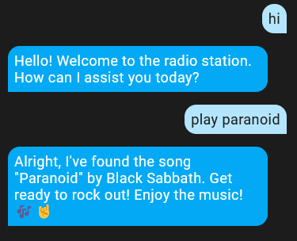

# dj-hass

A simple OpenAI and Spotify based demo-setup which exposes a simple function call API for GPT to find and play music on Spotify.
By this means it's possible to tell GPT "could you play that Paranoid song by Black Sabbath!"
For testing the API calls without Spotify, you can ask "what time is it". This invokes a call to get_current_datetime function.

Requirements:
- Spotify premium subscription
- OpenAI API-key (see OpenAI integration for instructions how to get that)
- Spotify client api key (see e.g. Spotcast integration for instructions how to get those)

To configure:
1. Add the repository files to custom_components and restart Home Assistant
2. Add integration DJ HASS
3. Configure options in order: (there's a bug at the moment, labels are missing)
     1. OpenAI API-key
     2. Spotify client ID
     3. Spotify client secret
  
Please consider this as a very preliminary hackish demo only :)

(Black Sabbath's Paranoid starts playing)